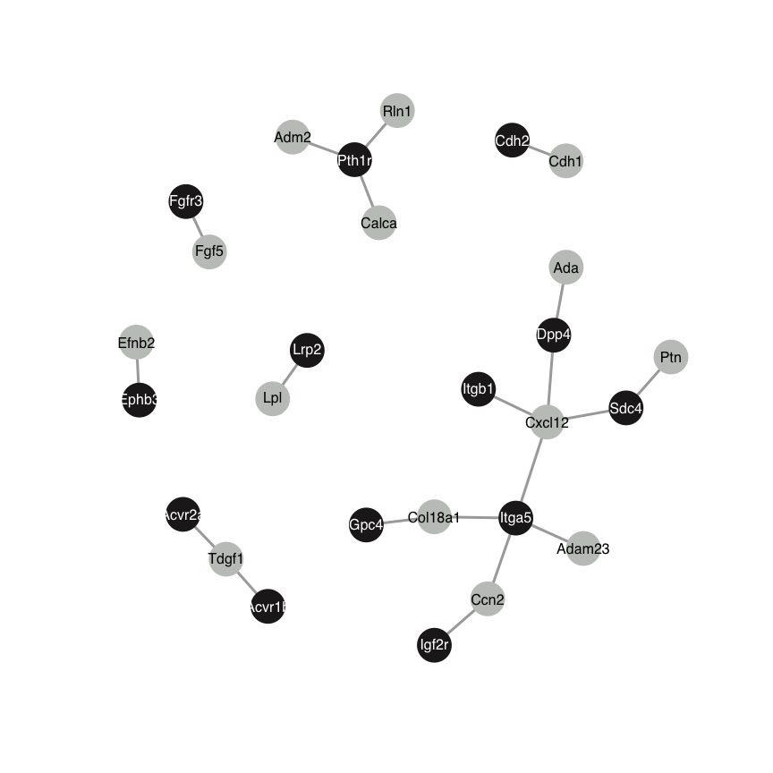

Cell-cell-communication analysis with LIANA
================

Load Packages

``` r
require(tidyverse)
```

    ## Loading required package: tidyverse

    ## ── Attaching packages ─────────────────────────────────────── tidyverse 1.3.2 ──
    ## ✔ ggplot2 3.4.0      ✔ purrr   1.0.1 
    ## ✔ tibble  3.1.8      ✔ dplyr   1.0.10
    ## ✔ tidyr   1.3.0      ✔ stringr 1.5.0 
    ## ✔ readr   2.1.3      ✔ forcats 0.5.2 
    ## ── Conflicts ────────────────────────────────────────── tidyverse_conflicts() ──
    ## ✖ dplyr::filter() masks stats::filter()
    ## ✖ dplyr::lag()    masks stats::lag()

``` r
require(magrittr)
```

    ## Loading required package: magrittr

    ## Warning: package 'magrittr' was built under R version 4.0.5

    ## 
    ## Attaching package: 'magrittr'
    ## 
    ## The following object is masked from 'package:purrr':
    ## 
    ##     set_names
    ## 
    ## The following object is masked from 'package:tidyr':
    ## 
    ##     extract

``` r
require(liana)
```

    ## Loading required package: liana

``` r
require(OmnipathR)
```

    ## Loading required package: OmnipathR
    ## Loading required package: igraph
    ## 
    ## Attaching package: 'igraph'
    ## 
    ## The following objects are masked from 'package:dplyr':
    ## 
    ##     as_data_frame, groups, union
    ## 
    ## The following objects are masked from 'package:purrr':
    ## 
    ##     compose, simplify
    ## 
    ## The following object is masked from 'package:tidyr':
    ## 
    ##     crossing
    ## 
    ## The following object is masked from 'package:tibble':
    ## 
    ##     as_data_frame
    ## 
    ## The following objects are masked from 'package:stats':
    ## 
    ##     decompose, spectrum
    ## 
    ## The following object is masked from 'package:base':
    ## 
    ##     union
    ## 
    ## Loading required package: jsonlite
    ## 
    ## Attaching package: 'jsonlite'
    ## 
    ## The following object is masked from 'package:purrr':
    ## 
    ##     flatten

``` r
library(Seurat)
```

    ## Attaching SeuratObject

Data preparation for running LIANA

``` r
# prepare dictionary for mouse human conversion
liana_path <- system.file(package = "liana")
symbols_dict <- readRDS(file.path(liana_path, "human_mouse_orthologues.RDS"))
head(symbols_dict)
```

    ##   TNFRSF13C         TTR        DSG3       FGF16        DSC1       ITGA5 
    ## "Tnfrsf13c"       "Ttr"      "Dsg3"     "Fgf16"      "Dsc1"     "Itga5"

``` r
# Here, we will convert LIANA's Consensus resource to murine symbols
op_resource <- select_resource("Consensus")[[1]]

# Generate orthologous resource
ortholog_resource <- generate_orthologs(op_resource = op_resource,
                                        symbols_dict = symbols_dict)
```

Load in_vitro dataset as saved in
in_vitro_FeaturePlots+Clustering+AVE_DEGs.md

``` r
in_vitro <- readRDS("./Data/in_vitro_batch_corrected.Rds")
```

Rename and group clusters into Epi and VE

``` r
# Run LIANA with the orthologous resource
DefaultAssay(in_vitro) <- "integrated"
in_vitro <- RunPCA(in_vitro, npcs = 30, verbose = FALSE)
in_vitro <- RunUMAP(in_vitro, reduction = "pca", dims = 1:12, verbose = FALSE)
```

    ## Warning: The default method for RunUMAP has changed from calling Python UMAP via reticulate to the R-native UWOT using the cosine metric
    ## To use Python UMAP via reticulate, set umap.method to 'umap-learn' and metric to 'correlation'
    ## This message will be shown once per session

``` r
in_vitro <- FindNeighbors(in_vitro, reduction = "pca", verbose = FALSE)
in_vitro <- FindClusters(in_vitro, resolution = 0.2, verbose = FALSE)
in_vitro <- RenameIdents(in_vitro, '0' = 'VE', '1' = 'Epi', '2' = 'Epi', '3' = 'VE')
in_vitro$Celltype <- in_vitro@active.ident

Idents(in_vitro) <- "Sample"
BELAs <- subset(in_vitro, idents = "BELAs")
DefaultAssay(BELAs) <- "SCT"
Idents(BELAs) <- "Celltype"
```

Run LIANA

``` r
liana_test <- liana_wrap(BELAs,
                        resource = 'custom', # the resource has to be set to 'custom' to work with external resources
                        external_resource = ortholog_resource) # provide orthologous resource
```

    ## Expression from the `SCT` assay will be used

    ## Running LIANA with `Celltype` as labels!

    ## Warning in exec(output, ...): 378 genes and/or 0 cells were removed as they had
    ## no counts!

    ## Warning: `invoke()` is deprecated as of rlang 0.4.0.
    ## Please use `exec()` or `inject()` instead.
    ## This warning is displayed once per session.

    ## LIANA: LR summary stats calculated!

    ## Now Running: Natmi

    ## Now Running: Connectome

    ## Now Running: Logfc

    ## Now Running: Sca

    ## Now Running: Cellphonedb

``` r
# We can aggregate these results into a tibble with consensus ranks
liana_test <- liana_test %>%
  liana_aggregate()
```

    ## Now aggregating natmi

    ## Now aggregating connectome

    ## Now aggregating logfc

    ## Now aggregating sca

    ## Now aggregating cellphonedb

    ## Aggregating Ranks

``` r
# glimpse(liana_test)
```

Extract and plot interactions between Epi and VE. For visualization a
wrapper *own_interaction_graph* function defined in func_Liana_Graph.R
is used.

``` r
liana_test_2 <- filter(liana_test, source =="Epi")
liana_test_2 <- filter(liana_test_2, target =="VE")
# write_csv2(liana_test_2, "./20230418_LIANA_EpitoVE.csv")
liana_test_2 <- top_n(liana_test_2, 20, desc(aggregate_rank))
source("./func_Liana_Graph.R")
own_interaction_graph(liana_trunc = liana_test_2)
```

<!-- -->

``` r
sessionInfo()
```

    ## R version 4.0.4 (2021-02-15)
    ## Platform: x86_64-apple-darwin17.0 (64-bit)
    ## Running under: macOS Big Sur 10.16
    ## 
    ## Matrix products: default
    ## BLAS:   /Library/Frameworks/R.framework/Versions/4.0/Resources/lib/libRblas.dylib
    ## LAPACK: /Library/Frameworks/R.framework/Versions/4.0/Resources/lib/libRlapack.dylib
    ## 
    ## locale:
    ## [1] en_US.UTF-8/en_US.UTF-8/en_US.UTF-8/C/en_US.UTF-8/en_US.UTF-8
    ## 
    ## attached base packages:
    ## [1] stats     graphics  grDevices utils     datasets  methods   base     
    ## 
    ## other attached packages:
    ##  [1] SeuratObject_4.1.3 Seurat_4.1.1       OmnipathR_2.0.0    jsonlite_1.8.4    
    ##  [5] igraph_1.3.5       liana_0.1.3        magrittr_2.0.3     forcats_0.5.2     
    ##  [9] stringr_1.5.0      dplyr_1.0.10       purrr_1.0.1        readr_2.1.3       
    ## [13] tidyr_1.3.0        tibble_3.1.8       ggplot2_3.4.0      tidyverse_1.3.2   
    ## 
    ## loaded via a namespace (and not attached):
    ##   [1] utf8_1.2.2                  reticulate_1.27            
    ##   [3] tidyselect_1.2.0            htmlwidgets_1.6.1          
    ##   [5] grid_4.0.4                  BiocParallel_1.24.1        
    ##   [7] Rtsne_0.16                  munsell_0.5.0              
    ##   [9] codetools_0.2-18            ica_1.0-3                  
    ##  [11] statmod_1.5.0               scran_1.18.7               
    ##  [13] future_1.30.0               miniUI_0.1.1.1             
    ##  [15] withr_2.5.0                 spatstat.random_3.1-3      
    ##  [17] colorspace_2.1-0            progressr_0.13.0           
    ##  [19] Biobase_2.50.0              highr_0.10                 
    ##  [21] knitr_1.42                  rstudioapi_0.14            
    ##  [23] stats4_4.0.4                SingleCellExperiment_1.12.0
    ##  [25] ROCR_1.0-11                 tensor_1.5                 
    ##  [27] listenv_0.9.0               MatrixGenerics_1.2.1       
    ##  [29] GenomeInfoDbData_1.2.4      polyclip_1.10-4            
    ##  [31] parallelly_1.34.0           vctrs_0.5.2                
    ##  [33] generics_0.1.3              xfun_0.36                  
    ##  [35] timechange_0.2.0            R6_2.5.1                   
    ##  [37] GenomeInfoDb_1.26.7         ggbeeswarm_0.7.1           
    ##  [39] clue_0.3-63                 rsvd_1.0.5                 
    ##  [41] locfit_1.5-9.4              bitops_1.0-7               
    ##  [43] spatstat.utils_3.0-1        DelayedArray_0.16.3        
    ##  [45] assertthat_0.2.1            promises_1.2.0.1           
    ##  [47] scales_1.2.1                googlesheets4_1.0.1        
    ##  [49] beeswarm_0.4.0              gtable_0.3.1               
    ##  [51] beachmat_2.6.4              Cairo_1.5-15               
    ##  [53] globals_0.16.2              goftest_1.2-3              
    ##  [55] rlang_1.0.6                 GlobalOptions_0.1.2        
    ##  [57] splines_4.0.4               lazyeval_0.2.2             
    ##  [59] gargle_1.2.1                spatstat.geom_3.0-5        
    ##  [61] broom_1.0.3                 yaml_2.3.7                 
    ##  [63] reshape2_1.4.4              abind_1.4-5                
    ##  [65] modelr_0.1.10               backports_1.4.1            
    ##  [67] httpuv_1.6.8                tools_4.0.4                
    ##  [69] ellipsis_0.3.2              spatstat.core_2.4-4        
    ##  [71] RColorBrewer_1.1-3          BiocGenerics_0.36.1        
    ##  [73] ggridges_0.5.4              Rcpp_1.0.10                
    ##  [75] plyr_1.8.8                  sparseMatrixStats_1.2.1    
    ##  [77] zlibbioc_1.36.0             RCurl_1.98-1.9             
    ##  [79] rpart_4.1.19                deldir_1.0-6               
    ##  [81] viridis_0.6.2               pbapply_1.7-0              
    ##  [83] GetoptLong_1.0.5            cowplot_1.1.1              
    ##  [85] S4Vectors_0.28.1            zoo_1.8-11                 
    ##  [87] SummarizedExperiment_1.20.0 haven_2.5.1                
    ##  [89] ggrepel_0.9.2               cluster_2.1.4              
    ##  [91] fs_1.6.0                    RSpectra_0.16-1            
    ##  [93] data.table_1.14.6           scattermore_0.8            
    ##  [95] circlize_0.4.15             lmtest_0.9-40              
    ##  [97] reprex_2.0.2                RANN_2.6.1                 
    ##  [99] googledrive_2.0.0           fitdistrplus_1.1-8         
    ## [101] matrixStats_0.63.0          hms_1.1.2                  
    ## [103] patchwork_1.1.2             mime_0.12                  
    ## [105] evaluate_0.20               xtable_1.8-4               
    ## [107] RobustRankAggreg_1.2.1      readxl_1.4.1               
    ## [109] IRanges_2.24.1              gridExtra_2.3              
    ## [111] shape_1.4.6                 scater_1.18.6              
    ## [113] compiler_4.0.4              KernSmooth_2.23-20         
    ## [115] crayon_1.5.2                htmltools_0.5.4            
    ## [117] mgcv_1.8-41                 later_1.3.0                
    ## [119] tzdb_0.3.0                  lubridate_1.9.1            
    ## [121] DBI_1.1.3                   dbplyr_2.3.0               
    ## [123] ComplexHeatmap_2.6.2        MASS_7.3-58.2              
    ## [125] Matrix_1.5-3                cli_3.6.0                  
    ## [127] parallel_4.0.4              GenomicRanges_1.42.0       
    ## [129] pkgconfig_2.0.3             sp_1.6-0                   
    ## [131] plotly_4.10.1               scuttle_1.0.4              
    ## [133] spatstat.sparse_3.0-0       xml2_1.3.3                 
    ## [135] vipor_0.4.5                 dqrng_0.3.0                
    ## [137] XVector_0.30.0              rvest_1.0.3                
    ## [139] digest_0.6.31               sctransform_0.3.5          
    ## [141] RcppAnnoy_0.0.20            spatstat.data_3.0-0        
    ## [143] rmarkdown_2.20              cellranger_1.1.0           
    ## [145] leiden_0.4.3                uwot_0.1.10                
    ## [147] edgeR_3.32.1                DelayedMatrixStats_1.12.3  
    ## [149] shiny_1.7.4                 rjson_0.2.21               
    ## [151] nlme_3.1-161                lifecycle_1.0.3            
    ## [153] BiocNeighbors_1.8.2         viridisLite_0.4.1          
    ## [155] limma_3.46.0                fansi_1.0.4                
    ## [157] pillar_1.8.1                lattice_0.20-45            
    ## [159] fastmap_1.1.0               httr_1.4.4                 
    ## [161] survival_3.5-0              glue_1.6.2                 
    ## [163] png_0.1-8                   bluster_1.0.0              
    ## [165] stringi_1.7.12              BiocSingular_1.6.0         
    ## [167] irlba_2.3.5.1               future.apply_1.10.0
