Test2
================
Max Fernkorn
2/17/2022

# 1 BELAs, PrE Cysts and Epi Cysts dataset preprocessing

## 1.1 Data loading and filtering

Demultiplexing of the sequencing data, alignment to the mouse genome
(mm10) and read quantification was performed with CellRanger (10x
Genomics, v4.0.0) for each sample of origin (BELAs, Epi cysts and PrE
Cysts) seperatly. After loading into R and creation of a Seurat Object,
cells with more than 10% of the reads aligned to mitochondrial genes as
well as less than 4000 different detected features were filtered out.

``` r
suppressPackageStartupMessages({
  library(Seurat)
  library(ggplot2)
  library(pheatmap)
  library(data.table)
  library(SeuratDisk)
  library(dendsort)
})
options(future.globals.maxSize = 8000 * 1024^2)

# Load in vitro data and filter for mt% and nFeature
read10x_filter_seurat <- function(matrix_path, sample_id){
  raw_counts <- Read10X(matrix_path)
  raw_counts <- CreateSeuratObject(counts=raw_counts, project=sample_id) 
  raw_counts$percent.MT <- PercentageFeatureSet(raw_counts, pattern="^mt-" )
  raw_counts <- subset(raw_counts, subset = nFeature_RNA > 4000 & percent.MT < 10)
  return(raw_counts)
}
path_BELAs = "./Data/BELAs/filtered_feature_bc_matrix/"
path_EpiCysts ="./Data/EpiCysts/filtered_feature_bc_matrix/"
path_PrECysts = "./Data/PrECysts/filtered_feature_bc_matrix/"

BELAs = read10x_filter_seurat(path_BELAs, "BELAs")
EpiCysts = read10x_filter_seurat(path_EpiCysts, "Epi Cysts")
PrECysts = read10x_filter_seurat(path_PrECysts, "PrE Cysts")
```

## 1.2 Basic data analysis

Datasets from all three sample of origins were merged and normalization
was perfomred using `SCTransform()` with default parameters. Principal
component analysis was followed by Uniform Manifold Approximation and
Projection (UMAP) for visualization using `RunPCA()` and `RunUMAP()`.

``` r
# Clusters based on total dataset
in_vitro <- merge(BELAs, y = c(EpiCysts, PrECysts))
in_vitro <- SCTransform(in_vitro, verbose = FALSE)
in_vitro <- RunPCA(in_vitro, verbose = FALSE)
in_vitro <- RunUMAP(in_vitro, dims = 1:12, verbose = FALSE)
```

# 2\. Visualisation and Annotation of the in vitro dataset

To provide an overview about the dataset a UMAP Plot with the cells
colored according to the sample of origin was created.

``` r
# Umap plot for Figure 4B
DimPlot(in_vitro, reduction = "umap", group.by = "orig.ident", 
        cols = c( "BELAs"="#F8766D",  "Epi Cysts"="#D3D30B", "PrE Cysts"="#619CFF"), pt.size = 2) + 
  theme(aspect.ratio = 1, axis.text= element_blank(), axis.ticks = element_blank())
```

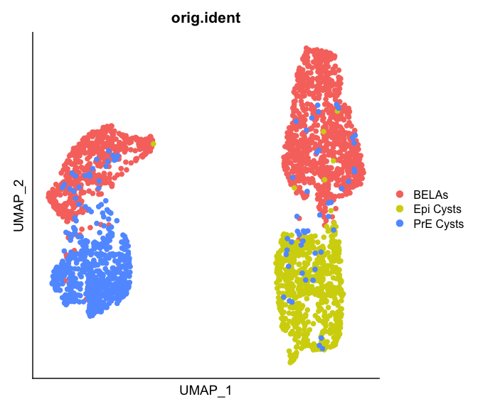<!-- -->

With Louvain clustering analysis using `FindNeighbors()`and
`FindClusters()` two groups of cells were identified within the BELA
cells. The resolution for clustering was set in order to obtain four
clusters to determine, which sample of origin divides into two seperate
clusters first. The identified clusters were renamed and shown in a UMAP
plot colored by the four clusters.

``` r
# Rename seurat clusters and save as Named CellTypes for later reference
in_vitro <- FindNeighbors(in_vitro, dims = 1:12, verbose = FALSE)
in_vitro <- FindClusters(in_vitro, resolution = 0.2, verbose = FALSE) # 4 clusters for resolutions between 0.07 and 0.27
in_vitro <- RenameIdents(in_vitro, '0' = '1', '1' = '2', '2' = '4', '3' = '3')
in_vitro$CellType <- in_vitro@active.ident

# Umap plot for Figure 4C
DimPlot(in_vitro, reduction = "umap", cols = c("1"="#01663A","2"= "#05CED8", "3"="#4C37B5", "4"="#BC0ABC"),
        pt.size = 2, group.by = "CellType") +
  theme(aspect.ratio = 1, axis.text= element_blank(), axis.ticks = element_blank())  
```

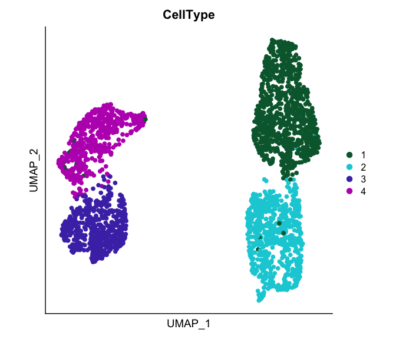<!-- -->

To annotate the identified clusters based on sample of origin a heatmap
with the relative proportion of each sample of origin per cluster was
used.

``` r
heatmap_prop = data.frame("Sample" = in_vitro@meta.data[["orig.ident"]],
                          "CellType" = in_vitro@meta.data[["CellType"]])
heatmap_prop <- prop.table(t(table(heatmap_prop)), margin = 2)[c(1,2,4,3),c(3,2,1)]
pheatmap(heatmap_prop, scale = "none", cluster_rows = FALSE,
         cluster_cols = FALSE, col=viridis::cividis(100), display_numbers =  TRUE, number_color = "black",
         gaps_col = 3, cellwidth = 50, cellheight = 50, fontsize_number = 14, breaks = seq(0,1,length = 100))
```

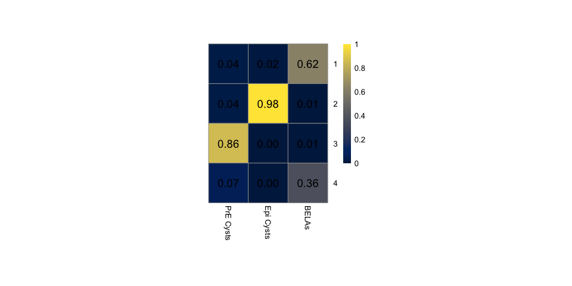<!-- -->

To annotate the identified clusters based on the cell lineage they
resemble expression of known marker genes for Epiblast and PrE lineages
were shown as a `FeaturePlot()` with the total dataset. We emphasized
changes in genes expression for selected marker genes by thresholding
the maximum value on the logarithmic scale.

``` r
# Feature Plots for Figure 4E
markers <- c("Gata6", "Sox17", "Dab2", "Cubn", "Pou5f1", "Sox2", "Nanog", "Fgf4")
cutoffs<- c("2", NA, NA, NA, NA, "2", NA, "1.5")

for (i in 1:length(markers)){
  print(FeaturePlot(in_vitro, features = markers[i], slot = "data", max.cutoff=cutoffs[i], pt.size = 1) +
    scale_colour_gradientn(colours = viridis::cividis(100)) + theme(aspect.ratio = 1) +
    theme(axis.text= element_blank(), axis.ticks = element_blank()))
}
```

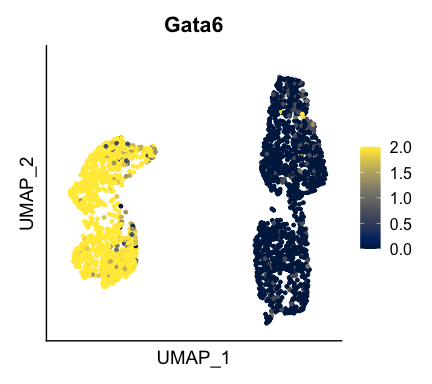<!-- -->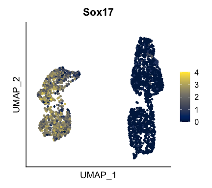<!-- -->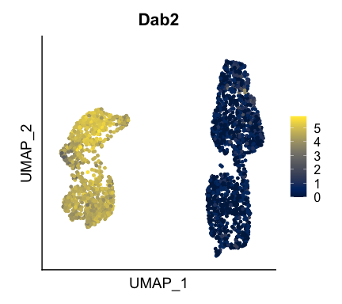<!-- -->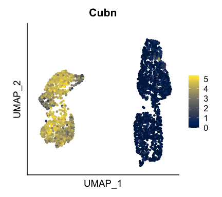<!-- -->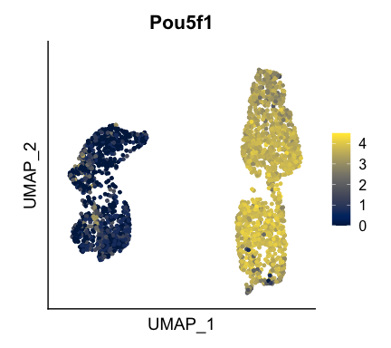<!-- -->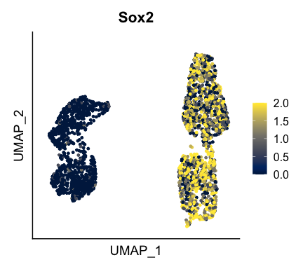<!-- -->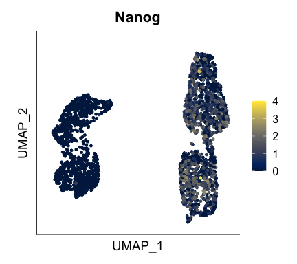<!-- -->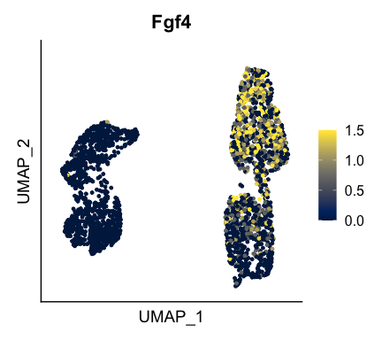<!-- -->

Based on this new labels were assigned to the identified clusters
indicating the main sample of origin characterizing the cluster (BELAs,
Epi cysts or PrE cysts) together with the information about the lineage
(Epi or PrE). For later comparison with an embryo dataset addtional
labels for the in vitro cells were assigned.

``` r
# Annotate in_vitro dataset
in_vitro <- RenameIdents(in_vitro, '1' = 'BELA-Epi', '2' = 'cyst-Epi', '4' = 'BELA-PrE', '3' = 'cyst-PrE')
in_vitro$CellType_Named <- in_vitro@active.ident
in_vitro$Origin <- "mESC"
in_vitro$Lineage <- in_vitro$orig.ident
in_vitro$Lineage_CellType <- in_vitro$CellType_Named
```
