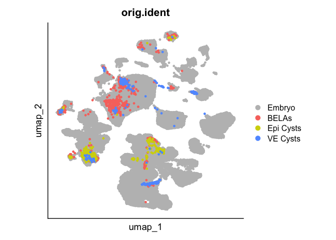
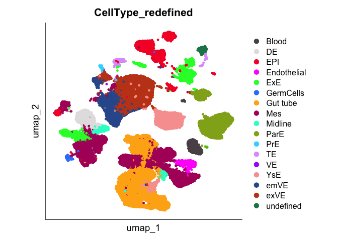
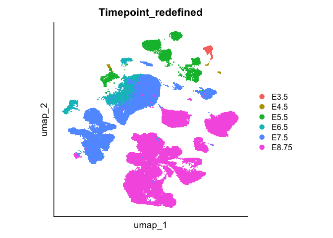
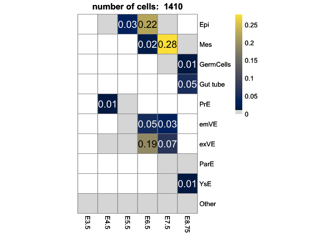
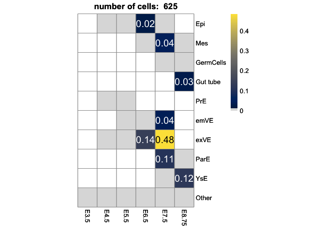
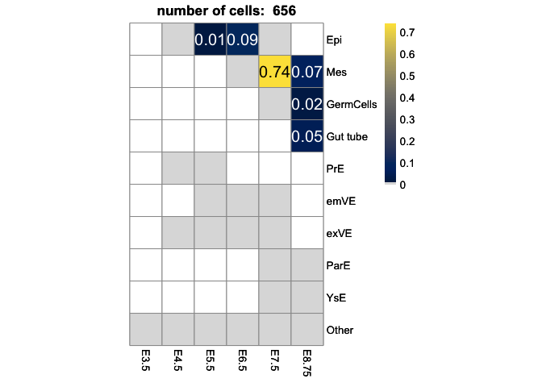

Visualization of Integration of in vitro data with embryo data from
Nowotschin et al., 2019
================

Load packages

``` r
library(Seurat)
```

    ## Attaching SeuratObject

``` r
library(SeuratDisk)
```

    ## Registered S3 method overwritten by 'SeuratDisk':
    ##   method            from  
    ##   as.sparse.H5Group Seurat

``` r
library(ggplot2)
library(pheatmap)
```

Load integrated data from python.

``` r
# Convert("./Data/Ingest_invitro_Nowotschin.h5ad", dest = "h5seurat", overwrite = TRUE)
integrated <- LoadH5Seurat("./Data/Ingest_invitro_Nowotschin.h5seurat")
```

    ## Validating h5Seurat file

    ## Initializing RNA with data

    ## Adding counts for RNA

    ## Adding feature-level metadata for RNA

    ## Adding reduction pca

    ## Adding cell embeddings for pca

    ## Adding miscellaneous information for pca

    ## Adding reduction umap

    ## Adding cell embeddings for umap

    ## Adding miscellaneous information for umap

    ## Adding command information

    ## Adding cell-level metadata

    ## Adding miscellaneous information

    ## Adding tool-specific results

Simplify annotations for visualization.

``` r
integrated@active.ident <- integrated$CellType
integrated <- RenameIdents(integrated, 'Blood' = 'Blood', 'DE' = 'DE', 'EPI' = 'EPI', 
                           'Endothelial' = 'Endothelial', 'ExE' = 'ExE', 
                           'GermCells' = 'GermCells','Gut tube' = 'Gut tube', 
                           'Gut tube:DE:Colon' = 'Gut tube','Gut tube:DE:Liver' = 'Gut tube',
                           'Gut tube:DE:Lung' = 'Gut tube','Gut tube:DE:Pancreas' = 'Gut tube',
                           'Gut tube:DE:Small int' = 'Gut tube',
                           'Gut tube:DE:Thymus' = 'Gut tube',
                           'Gut tube:DE:Thyroid' = 'Gut tube',
                           'Gut tube:VE:Colon' = 'Gut tube','Gut tube:VE:Liver' = 'Gut tube',
                           'Gut tube:VE:Lung' = 'Gut tube','Gut tube:VE:Pancreas' = 'Gut tube',
                           'Gut tube:VE:Small int' = 'Gut tube',
                           'Gut tube:VE:Thymus' = 'Gut tube',
                           'Gut tube:VE:Thyroid' = 'Gut tube','Mes' = 'Mes',
                           'Midline' = 'Midline', 'ParE' = 'ParE', 'PrE' = 'PrE', 'TE' = 'TE',
                           'VE' = 'VE', 'YsE' = 'YsE', 'emVE' = 'emVE', 'exVE' = 'exVE',
                           'undefined' = 'undefined')
integrated$CellType_redefined <- integrated@active.ident

integrated@active.ident <- integrated$Timepoint
integrated <- RenameIdents(integrated, 'E3.5' = 'E3.5', 'E4.5' = 'E4.5', 'E5.5' = 'E5.5', 
                           'E6.5' = 'E6.5', 'E7.5' = 'E7.5', 
                           'E8.75' = 'E8.75', 'E8.75_ap' = 'E8.75', 'E8.75_gfp' = 'E8.75')
integrated$Timepoint_redefined <- integrated@active.ident

integrated@active.ident <- integrated$orig.ident
integrated <- RenameIdents(integrated, 'nan' = 'Embryo')
integrated$orig.ident <- integrated@active.ident
```

Create UMAP visualization with various annotations.

``` r
DimPlot(integrated, reduction = "umap", group.by = "orig.ident", pt.size = 1,raster=FALSE,
        cols = c("BELAs"="#F8766D",  "Epi Cysts"="#D3D30B", 
                 "VE Cysts"="#619CFF", "Embryo"="grey")) + 
  theme(aspect.ratio = 1, axis.text= element_blank(), axis.ticks = element_blank())
```

<!-- -->

``` r
DimPlot(integrated, reduction = "umap", group.by = "CellType_redefined", 
        pt.size = 1,raster=FALSE,
        cols = DiscretePalette(17, palette = "polychrome")) + 
  theme(aspect.ratio = 1, axis.text= element_blank(), axis.ticks = element_blank())
```

<!-- -->

``` r
DimPlot(integrated, reduction = "umap", group.by = "Timepoint_redefined", pt.size = 1) + 
  theme(aspect.ratio = 1, axis.text= element_blank(), axis.ticks = element_blank())
```

    ## Rasterizing points since number of points exceeds 100,000.
    ## To disable this behavior set `raster=FALSE`

<!-- -->

Represent fractions of cell types as heatmaps.

``` r
# Combine labels for rare cell types:
integrated@active.ident <- integrated$CellType_redefined
integrated <- RenameIdents(integrated, 'Blood' = 'Other', 'DE' = 'Other', 'EPI' = 'Epi',
                           'Endothelial' = 'Other', 'ExE' = 'Other', 
                           'GermCells' = 'GermCells', 'Gut tube' = 'Gut tube', 'Mes' = 'Mes',
                           'Midline' = 'Other', 'ParE' = 'ParE', 
                           'PrE' = 'PrE', 'TE' = 'Other', 'VE' = 'Other', 'YsE' = 'YsE', 
                           'emVE' = 'emVE', 'exVE' = 'exVE', 'undefined' = 'Other')
integrated$CellType_redefined_2 <- integrated@active.ident


integrated@active.ident <- integrated$orig.ident
BELAs <- subset(integrated, idents = "BELAs")
VE_cysts <- subset(integrated, idents = "VE Cysts")
EPI_cysts <- subset(integrated, idents = "Epi Cysts")
heatmap_prop_integrated = data.frame(integrated@meta.data[["CellType_redefined_2"]],
                                     integrated@meta.data[["Timepoint_redefined"]])
heatmap_integrated_TRUE_FALSE <- (table(heatmap_prop_integrated)/sum(table(heatmap_prop_integrated)))[c(2,5,3,4,7,9,10,6,8,1),] == 0

source("./func_cell_fraction_heatmap.R")
pl_cell_frac_pheatmap_v2(object = BELAs, 
                         column_data = "Timepoint_redefined", 
                         row_data = "CellType_redefined_2", 
                         row_selection = c(2,5,3,4,7,9,10,6,8,1),
                         NA_tiles = heatmap_integrated_TRUE_FALSE,
                         threshold_value = 0.01)
```

<!-- -->

``` r
pl_cell_frac_pheatmap_v2(object = VE_cysts, 
                         column_data = "Timepoint_redefined", 
                         row_data = "CellType_redefined_2", 
                         row_selection = c(2,5,3,4,7,9,10,6,8,1),
                         NA_tiles = heatmap_integrated_TRUE_FALSE,                         
                         threshold_value = 0.01)
```

<!-- -->

``` r
pl_cell_frac_pheatmap_v2(object = EPI_cysts, 
                         column_data = "Timepoint_redefined", 
                         row_data = "CellType_redefined_2", 
                         row_selection = c(2,5,3,4,7,9,10,6,8,1),
                         NA_tiles = heatmap_integrated_TRUE_FALSE,
                         threshold_value = 0.01)
```

<!-- -->

``` r
sessionInfo()
```

    ## R version 4.0.4 (2021-02-15)
    ## Platform: x86_64-apple-darwin17.0 (64-bit)
    ## Running under: macOS Big Sur 10.16
    ## 
    ## Matrix products: default
    ## BLAS:   /Library/Frameworks/R.framework/Versions/4.0/Resources/lib/libRblas.dylib
    ## LAPACK: /Library/Frameworks/R.framework/Versions/4.0/Resources/lib/libRlapack.dylib
    ## 
    ## locale:
    ## [1] en_US.UTF-8/en_US.UTF-8/en_US.UTF-8/C/en_US.UTF-8/en_US.UTF-8
    ## 
    ## attached base packages:
    ## [1] stats     graphics  grDevices utils     datasets  methods   base     
    ## 
    ## other attached packages:
    ## [1] pheatmap_1.0.12       ggplot2_3.4.0         SeuratDisk_0.0.0.9019
    ## [4] SeuratObject_4.1.3    Seurat_4.1.1         
    ## 
    ## loaded via a namespace (and not attached):
    ##   [1] Rtsne_0.16            colorspace_2.1-0      deldir_1.0-6         
    ##   [4] ellipsis_0.3.2        ggridges_0.5.4        rstudioapi_0.14      
    ##   [7] spatstat.data_3.0-0   farver_2.1.1          leiden_0.4.3         
    ##  [10] listenv_0.9.0         bit64_4.0.5           ggrepel_0.9.2        
    ##  [13] fansi_1.0.4           codetools_0.2-18      splines_4.0.4        
    ##  [16] knitr_1.42            polyclip_1.10-4       jsonlite_1.8.4       
    ##  [19] ica_1.0-3             cluster_2.1.4         png_0.1-8            
    ##  [22] uwot_0.1.10           shiny_1.7.4           sctransform_0.3.5    
    ##  [25] spatstat.sparse_3.0-0 compiler_4.0.4        httr_1.4.4           
    ##  [28] assertthat_0.2.1      Matrix_1.5-3          fastmap_1.1.0        
    ##  [31] lazyeval_0.2.2        cli_3.6.0             later_1.3.0          
    ##  [34] htmltools_0.5.4       tools_4.0.4           igraph_1.3.5         
    ##  [37] gtable_0.3.1          glue_1.6.2            RANN_2.6.1           
    ##  [40] reshape2_1.4.4        dplyr_1.0.10          Rcpp_1.0.10          
    ##  [43] scattermore_0.8       vctrs_0.5.2           nlme_3.1-161         
    ##  [46] progressr_0.13.0      lmtest_0.9-40         spatstat.random_3.1-3
    ##  [49] xfun_0.36             stringr_1.5.0         globals_0.16.2       
    ##  [52] mime_0.12             miniUI_0.1.1.1        lifecycle_1.0.3      
    ##  [55] irlba_2.3.5.1         goftest_1.2-3         future_1.30.0        
    ##  [58] MASS_7.3-58.2         zoo_1.8-11            scales_1.2.1         
    ##  [61] spatstat.core_2.4-4   promises_1.2.0.1      spatstat.utils_3.0-1 
    ##  [64] parallel_4.0.4        RColorBrewer_1.1-3    yaml_2.3.7           
    ##  [67] reticulate_1.27       pbapply_1.7-0         gridExtra_2.3        
    ##  [70] rpart_4.1.19          stringi_1.7.12        highr_0.10           
    ##  [73] rlang_1.0.6           pkgconfig_2.0.3       matrixStats_0.63.0   
    ##  [76] evaluate_0.20         lattice_0.20-45       ROCR_1.0-11          
    ##  [79] purrr_1.0.1           tensor_1.5            labeling_0.4.2       
    ##  [82] patchwork_1.1.2       htmlwidgets_1.6.1     bit_4.0.5            
    ##  [85] cowplot_1.1.1         tidyselect_1.2.0      parallelly_1.34.0    
    ##  [88] RcppAnnoy_0.0.20      plyr_1.8.8            magrittr_2.0.3       
    ##  [91] R6_2.5.1              generics_0.1.3        DBI_1.1.3            
    ##  [94] withr_2.5.0           mgcv_1.8-41           pillar_1.8.1         
    ##  [97] fitdistrplus_1.1-8    survival_3.5-0        abind_1.4-5          
    ## [100] sp_1.6-0              tibble_3.1.8          future.apply_1.10.0  
    ## [103] hdf5r_1.3.8           crayon_1.5.2          KernSmooth_2.23-20   
    ## [106] utf8_1.2.2            spatstat.geom_3.0-5   plotly_4.10.1        
    ## [109] rmarkdown_2.20        viridis_0.6.2         grid_4.0.4           
    ## [112] data.table_1.14.6     digest_0.6.31         xtable_1.8-4         
    ## [115] tidyr_1.3.0           httpuv_1.6.8          munsell_0.5.0        
    ## [118] viridisLite_0.4.1
