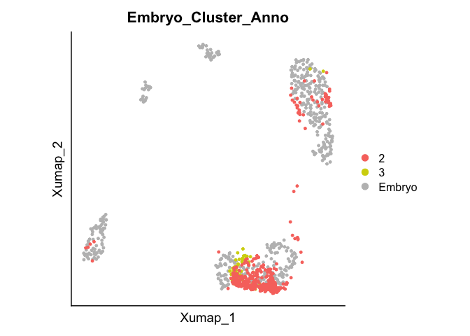
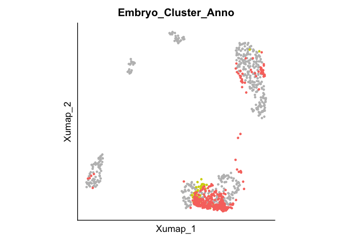
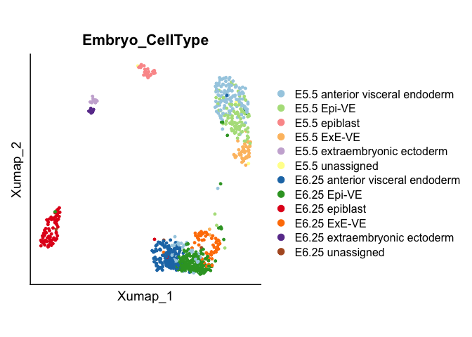
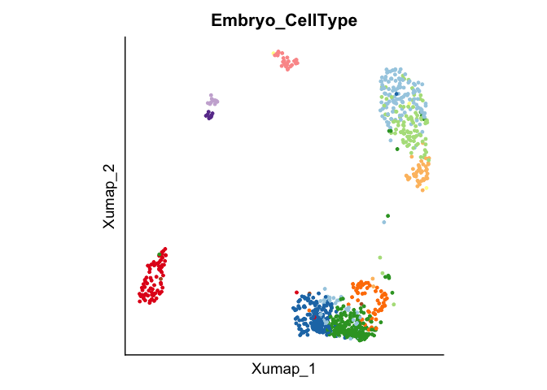
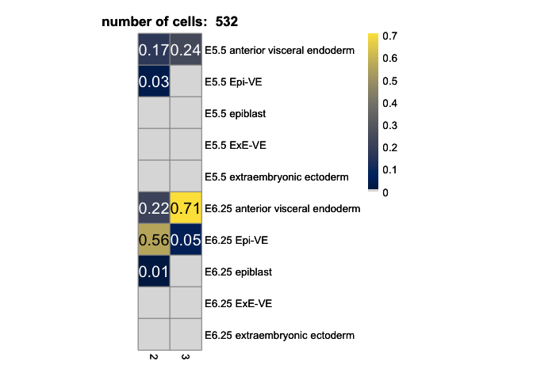

Visualization of Integration of in vitro data (BELA-AVE and BELA-VE)
with embryo data from Thowfeequ et al., 2022
================

Load Packages

``` r
library(Seurat)
```

    ## Attaching SeuratObject

``` r
library(SeuratDisk)
```

    ## Registered S3 method overwritten by 'SeuratDisk':
    ##   method            from  
    ##   as.sparse.H5Group Seurat

``` r
library(ggplot2)
library(pheatmap)
library(data.table)
```

Load data from csv files with integrated data exported in python.

``` r
#Load counts, meta data and dim reductions
counts<-fread("./Data/Thowfeequ_dataset/20230210_Ingest_invitro_BELA-VE+AVE_Thowfeequ_annotation_Stage.csv", data.table=FALSE)
meta.data <- fread("./Data/Thowfeequ_dataset/20230210_Ingest_invitro_BELA-VE+AVE_Thowfeequ_annotation_Stage/obs.csv", data.table=FALSE)
umap <- as.matrix(fread("./Data/Thowfeequ_dataset/20230210_Ingest_invitro_BELA-VE+AVE_Thowfeequ_annotation_Stage/obsm.csv", data.table=FALSE)[,51:52])

# Get counts of requested conditions (Note that t(as.Matrix()) changed cell names, therefore direct assignment
rownames(counts) <- counts[,1]
Cellnames <- counts[,1]
counts[,1] <- NULL
counts <- data.frame(t(counts)) # This is slow
colnames(counts) <- Cellnames
# Get meta.data of requested conditions
rownames(meta.data) <- meta.data[,1]
meta.data[,1] <- NULL

# Modify UMAP by naming rows
rownames(umap) <- colnames(counts)

#Create Seurat object with counts and meta data
integrated <- CreateSeuratObject(counts, meta.data = meta.data) # slow again

# Add dimensionality reduction from loaded csv (only umap)
integrated[["UMAP"]] <- CreateDimReducObject(embeddings = umap, key = "X_umap", assay = DefaultAssay(integrated))
```

    ## Warning: Keys should be one or more alphanumeric characters followed by an
    ## underscore, setting key from X_umap to Xumap_

    ## Warning: All keys should be one or more alphanumeric characters followed by an
    ## underscore '_', setting key to Xumap_

``` r
integrated@active.ident <- factor(integrated$orig.ident)
integrated <- RenameIdents(integrated, 'nan' = 'Embryo')
integrated$orig.ident <- integrated@active.ident

integrated$Embryo_Cluster_Anno <- "Embryo"
integrated$Embryo_Cluster_Anno[colnames(subset(integrated, Cluster == 2 | Cluster == 3))] <- integrated$Cluster[colnames(subset(integrated, Cluster == 2 | Cluster == 3))]

integrated$Embryo_CellType <- factor(integrated$Embryo_CellType)
```

Visualize Integration in UMAP space, annotated by Cluster or Celltype.

``` r
# UMAP Plots with various annotations
DimPlot(integrated, reduction = "UMAP", group.by = "Embryo_Cluster_Anno", pt.size = 1,raster=FALSE,
        cols = c("2"="#F8766D",  "3"="#D3D30B", "Embryo"="grey")) + 
  theme(aspect.ratio = 1, axis.text= element_blank(), axis.ticks = element_blank())
```

<!-- -->

``` r
DimPlot(integrated, reduction = "UMAP", group.by = "Embryo_Cluster_Anno", pt.size = 1,raster=FALSE,
        cols = c("2"="#F8766D",  "3"="#D3D30B", "Embryo"="grey")) + 
  theme(aspect.ratio = 1, axis.text= element_blank(), axis.ticks = element_blank(), legend.position = "none")
```

<!-- -->

``` r
DimPlot(integrated, reduction = "UMAP", group.by = "Embryo_CellType", pt.size = 1,raster=FALSE,
        cols = c("#a6cee3","#b2df8a","#fb9a99","#fdbf6f","#cab2d6","#ffff99", "#1f78b4",
                          "#33a02c", "#e31a1c","#ff7f00", "#6a3d9a","#b15928")) + 
  theme(aspect.ratio = 1, axis.text= element_blank(), axis.ticks = element_blank())
```

<!-- -->

``` r
DimPlot(integrated, reduction = "UMAP", group.by = "Embryo_CellType", pt.size = 1,raster=FALSE,
        cols = c("#a6cee3","#b2df8a","#fb9a99","#fdbf6f","#cab2d6", "#ffff99", "#1f78b4", 
                          "#33a02c", "#e31a1c","#ff7f00", "#6a3d9a","#b15928")) + 
  theme(aspect.ratio = 1, axis.text= element_blank(), axis.ticks = element_blank(), legend.position = "none")
```

<!-- -->

Plot Heatmap with fractions of cell types per cluster.

``` r
# Heatmaps for the label transfer
#Put together rare cell types:
integrated@active.ident <- integrated$orig.ident
BELAs <- subset(integrated, idents = "BELAs")
BELAs$Embryo_Cluster_Anno <- factor(BELAs@meta.data[["Embryo_Cluster_Anno"]])

source("./func_cell_fraction_heatmap.R")
pl_cell_frac_pheatmap_v2(object = BELAs,
                         column_data = "Embryo_Cluster_Anno",
                         row_data = "Embryo_CellType",
                         row_selection = c(1:5,7:11),
                         threshold_value = 0.01,
                         ratio = "column")
```

<!-- -->

``` r
# NA_tiles = data.frame(rep(FALSE,10),c(FALSE,FALSE,FALSE,TRUE,FALSE,FALSE,FALSE,FALSE,FALSE,TRUE))
```

``` r
sessionInfo()
```

    ## R version 4.0.4 (2021-02-15)
    ## Platform: x86_64-apple-darwin17.0 (64-bit)
    ## Running under: macOS Big Sur 10.16
    ## 
    ## Matrix products: default
    ## BLAS:   /Library/Frameworks/R.framework/Versions/4.0/Resources/lib/libRblas.dylib
    ## LAPACK: /Library/Frameworks/R.framework/Versions/4.0/Resources/lib/libRlapack.dylib
    ## 
    ## locale:
    ## [1] en_US.UTF-8/en_US.UTF-8/en_US.UTF-8/C/en_US.UTF-8/en_US.UTF-8
    ## 
    ## attached base packages:
    ## [1] stats     graphics  grDevices utils     datasets  methods   base     
    ## 
    ## other attached packages:
    ## [1] data.table_1.14.6     pheatmap_1.0.12       ggplot2_3.4.0        
    ## [4] SeuratDisk_0.0.0.9019 SeuratObject_4.1.3    Seurat_4.1.1         
    ## 
    ## loaded via a namespace (and not attached):
    ##   [1] Rtsne_0.16            colorspace_2.1-0      deldir_1.0-6         
    ##   [4] ellipsis_0.3.2        ggridges_0.5.4        rstudioapi_0.14      
    ##   [7] spatstat.data_3.0-0   farver_2.1.1          leiden_0.4.3         
    ##  [10] listenv_0.9.0         bit64_4.0.5           ggrepel_0.9.2        
    ##  [13] fansi_1.0.4           codetools_0.2-18      splines_4.0.4        
    ##  [16] knitr_1.42            polyclip_1.10-4       jsonlite_1.8.4       
    ##  [19] ica_1.0-3             cluster_2.1.4         png_0.1-8            
    ##  [22] uwot_0.1.10           shiny_1.7.4           sctransform_0.3.5    
    ##  [25] spatstat.sparse_3.0-0 compiler_4.0.4        httr_1.4.4           
    ##  [28] assertthat_0.2.1      Matrix_1.5-3          fastmap_1.1.0        
    ##  [31] lazyeval_0.2.2        cli_3.6.0             later_1.3.0          
    ##  [34] htmltools_0.5.4       tools_4.0.4           igraph_1.3.5         
    ##  [37] gtable_0.3.1          glue_1.6.2            RANN_2.6.1           
    ##  [40] reshape2_1.4.4        dplyr_1.0.10          Rcpp_1.0.10          
    ##  [43] scattermore_0.8       vctrs_0.5.2           nlme_3.1-161         
    ##  [46] progressr_0.13.0      lmtest_0.9-40         spatstat.random_3.1-3
    ##  [49] xfun_0.36             stringr_1.5.0         globals_0.16.2       
    ##  [52] mime_0.12             miniUI_0.1.1.1        lifecycle_1.0.3      
    ##  [55] irlba_2.3.5.1         goftest_1.2-3         future_1.30.0        
    ##  [58] MASS_7.3-58.2         zoo_1.8-11            scales_1.2.1         
    ##  [61] spatstat.core_2.4-4   promises_1.2.0.1      spatstat.utils_3.0-1 
    ##  [64] parallel_4.0.4        RColorBrewer_1.1-3    yaml_2.3.7           
    ##  [67] reticulate_1.27       pbapply_1.7-0         gridExtra_2.3        
    ##  [70] rpart_4.1.19          stringi_1.7.12        highr_0.10           
    ##  [73] rlang_1.0.6           pkgconfig_2.0.3       matrixStats_0.63.0   
    ##  [76] evaluate_0.20         lattice_0.20-45       ROCR_1.0-11          
    ##  [79] purrr_1.0.1           tensor_1.5            labeling_0.4.2       
    ##  [82] patchwork_1.1.2       htmlwidgets_1.6.1     bit_4.0.5            
    ##  [85] cowplot_1.1.1         tidyselect_1.2.0      parallelly_1.34.0    
    ##  [88] RcppAnnoy_0.0.20      plyr_1.8.8            magrittr_2.0.3       
    ##  [91] R6_2.5.1              generics_0.1.3        DBI_1.1.3            
    ##  [94] withr_2.5.0           mgcv_1.8-41           pillar_1.8.1         
    ##  [97] fitdistrplus_1.1-8    survival_3.5-0        abind_1.4-5          
    ## [100] sp_1.6-0              tibble_3.1.8          future.apply_1.10.0  
    ## [103] hdf5r_1.3.8           crayon_1.5.2          KernSmooth_2.23-20   
    ## [106] utf8_1.2.2            spatstat.geom_3.0-5   plotly_4.10.1        
    ## [109] rmarkdown_2.20        viridis_0.6.2         grid_4.0.4           
    ## [112] digest_0.6.31         xtable_1.8-4          tidyr_1.3.0          
    ## [115] httpuv_1.6.8          munsell_0.5.0         viridisLite_0.4.1
