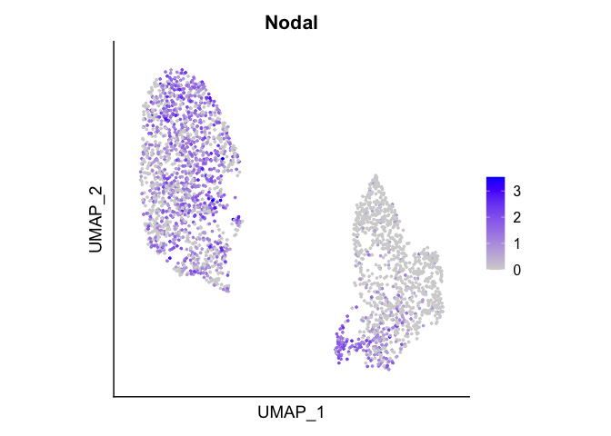

Analysis of the in vitro scRNAseq dataset
================

### Including integration for batch correction, clustering and DEG identification and visualization

Import required packages

``` r
suppressPackageStartupMessages({
  library(Seurat)
  library(ggplot2)
  library(SeuratDisk)
  library(pheatmap)
})
options(future.globals.maxSize = 8000 * 1024^2)
```

Load in vitro data (CellRanger Output, as at
[GSE198780](https://www.ncbi.nlm.nih.gov/geo/query/acc.cgi?acc=GSE198780))

``` r
read10x_filter_seurat <- function(matrix_path, sample_id){
  raw_counts <- Read10X(matrix_path)
  raw_counts <- CreateSeuratObject(counts=raw_counts, project=sample_id) 
  raw_counts$percent.MT <- PercentageFeatureSet(raw_counts, pattern="^mt-" )
  raw_counts <- subset(raw_counts, subset = nFeature_RNA > 4000 & percent.MT < 10)
  return(raw_counts)
}
path_BELAs = "./Data/BELAs/"
path_EpiCysts ="./Data/EpiCysts/"
path_PrECysts = "./Data/VECysts/"

BELAs = read10x_filter_seurat(path_BELAs, "BELAs")
```

    ## as(<dgTMatrix>, "dgCMatrix") is deprecated since Matrix 1.5-0; do as(., "CsparseMatrix") instead

``` r
EpiCysts = read10x_filter_seurat(path_EpiCysts, "Epi Cysts")
VECysts = read10x_filter_seurat(path_PrECysts, "VE Cysts")
```

Remove batch effects between samples by RPCA based integration in
Seurat.

``` r
data.list <- list(BELAs, EpiCysts, VECysts)
data.list <- lapply(X = data.list, FUN = SCTransform, verbose = FALSE)
data.list <- lapply(X = data.list, FUN = RunPCA, verbose = FALSE)

data.list.features <- SelectIntegrationFeatures(object.list = data.list, 
                                                nfeatures = 3000, verbose = FALSE)
data.list <- PrepSCTIntegration(object.list = data.list, 
                                anchor.features = data.list.features, verbose = FALSE)
anchors <- FindIntegrationAnchors(object.list = data.list, normalization.method = "SCT", 
                                  dims = 1:30, anchor.features = data.list.features, 
                                  reduction = "rpca", verbose = FALSE)
in_vitro <- IntegrateData(anchorset = anchors, normalization.method = "SCT", 
                          dims = 1:30, verbose = FALSE)
```

Run dimensionality reduction and plot UMAP annotated by sample of
origin.

``` r
DefaultAssay(in_vitro) <- "integrated"
in_vitro <- RunPCA(in_vitro, npcs = 30, verbose = FALSE)
in_vitro <- RunUMAP(in_vitro, reduction = "pca", dims = 1:12, verbose = FALSE)
```

    ## Warning: The default method for RunUMAP has changed from calling Python UMAP via reticulate to the R-native UWOT using the cosine metric
    ## To use Python UMAP via reticulate, set umap.method to 'umap-learn' and metric to 'correlation'
    ## This message will be shown once per session

``` r
DimPlot(in_vitro, reduction = "umap", group.by = "orig.ident", pt.size = 1,
        cols = c("BELAs"="#F8766D",  "Epi Cysts"="#D3D30B", "VE Cysts"="#619CFF")) + 
  theme(aspect.ratio = 1, axis.text= element_blank(), axis.ticks = element_blank())
```

<!-- -->

Visualize expression of known VE and Epi marker genes as FeaturePlots.

``` r
DefaultAssay(in_vitro) <- "SCT"
markers <- c("Gata6", "Sox17", "Dab2", "Cubn", "Pou5f1", "Sox2", "Nanog", "Fgf4")
cutoffs<- c(NA, NA, NA, NA, NA, "2", "2", "1.5")
for (i in 1:length(markers)){
  print(FeaturePlot(in_vitro, features = markers[i], slot = "data", 
                    max.cutoff=cutoffs[i], pt.size = 1) + 
          scale_colour_gradientn(colours = viridis::cividis(100)) + theme(aspect.ratio = 1) +
          theme(axis.text= element_blank(), axis.ticks = element_blank()))
}
```

    ## Scale for colour is already present.
    ## Adding another scale for colour, which will replace the existing scale.
    ## Scale for colour is already present.
    ## Adding another scale for colour, which will replace the existing scale.

<!-- -->

    ## Scale for colour is already present.
    ## Adding another scale for colour, which will replace the existing scale.

<!-- -->

    ## Scale for colour is already present.
    ## Adding another scale for colour, which will replace the existing scale.

<!-- -->

    ## Scale for colour is already present.
    ## Adding another scale for colour, which will replace the existing scale.

<!-- -->

    ## Scale for colour is already present.
    ## Adding another scale for colour, which will replace the existing scale.

<!-- -->

    ## Scale for colour is already present.
    ## Adding another scale for colour, which will replace the existing scale.

<!-- -->

    ## Scale for colour is already present.
    ## Adding another scale for colour, which will replace the existing scale.

<!-- --><!-- -->

Cluster and visualize transcriptomes in UMAP space.

``` r
DefaultAssay(in_vitro) <- "integrated"
in_vitro <- FindNeighbors(in_vitro, reduction = "pca", verbose = FALSE)
in_vitro <- FindClusters(in_vitro, resolution = 0.2, verbose = FALSE)
in_vitro <- RenameIdents(in_vitro, '0' = '3', '1' = '1', '2' = '2', '3' = '4')
levels(x = in_vitro) <- c('1', '2', '3', '4')
in_vitro$Cluster <- in_vitro@active.ident

# Umap by Cluster
DimPlot(in_vitro, reduction = "umap", group.by = "Cluster", pt.size = 1,
        cols = c("#8ABB93", "#0F5C35", "#C2A3C1", "#F6A348")) + 
  theme(aspect.ratio = 1, axis.text= element_blank(), axis.ticks = element_blank())
```

<!-- -->

Plot proportions of cells from each sample in each cluster as a heatmap,
using the custom pl_cell_frac_pheatmap_v2 function.

``` r
in_vitro$Sample <- factor(in_vitro$orig.ident, levels = c("BELAs","VE Cysts","Epi Cysts"))
source("./func_cell_fraction_heatmap.R")
pl_cell_frac_pheatmap_v2(in_vitro,
                         column_data = "Cluster",
                         row_data = "Sample",
                         include_absolute_values = TRUE,
                         ratio = "column")
```

<!-- -->

Find and visualize the differentially expressed genes between the AVE
cluster and all other VE-like cells, including cells from BELAs and VE
cysts.

``` r
# Display differentially expressed genes of AVE as heatmap
# Prepare Data for subsetting
in_vitro$orig_ident_CellType <- paste(in_vitro$Sample, in_vitro$Cluster, sep = ": ")
Idents(in_vitro) <- "orig_ident_CellType"

# DE Genes for AVE cluster
in_vitro <- PrepSCTFindMarkers(in_vitro)
```

    ## Found 3 SCT models. Recorrecting SCT counts using minimum median counts: 58554

``` r
AVE.dif_AVE <- FindMarkers(in_vitro, assay = "SCT", ident.1 = "BELAs: 4", 
                           ident.2 = c("BELAs: 3", "VE Cysts: 3"), only.pos = TRUE, 
                           verbose = FALSE)
AVE.dif_VE <- FindMarkers(in_vitro, ident.1 = c("BELAs: 3", "VE Cysts: 3"), 
                           ident.2 = "BELAs: 4", only.pos = TRUE, verbose = FALSE)


heat_data <- subset(in_vitro, idents = c("BELAs: 4", "BELAs: 3", "VE Cysts: 3"))
heat_data$orig_ident_CellType <- factor(heat_data@active.ident, 
                                        levels = c("BELAs: 4", "BELAs: 3", "VE Cysts: 3"),
                                        ordered = TRUE)

heat_data <- SCTransform(heat_data, return.only.var.genes = FALSE, verbose = FALSE) # To get SCT value for all genes

# write.csv2(AVE.dif_AVE[order(-AVE.dif_AVE$avg_log2FC), ], "./Table_S1_upreg_in_AVE.csv")
# write.csv2(AVE.dif_VE[order(-AVE.dif_VE$avg_log2FC), ], "./Table_S1_upreg_in_VE.csv")

genes <- c(rownames(AVE.dif_AVE[order(-AVE.dif_AVE$avg_log2FC), ])[1:30], 
           rownames(AVE.dif_VE[order(-AVE.dif_VE$avg_log2FC), ])[1:30])
heat_frame <- heat_data@assays[["SCT"]]@scale.data[genes,]
heatmap_col_anno <- data.frame("Cluster" = heat_data$orig_ident_CellType)
heat_frame <- heat_frame[,order(heat_data$orig_ident_CellType)]
pheatmap(heat_frame, scale = "none", cluster_rows = FALSE, 
         col=viridis::cividis(100), show_colnames = FALSE,
         cluster_cols = FALSE, annotation_col = heatmap_col_anno, gaps_col = c(62,532), 
         cellwidth = 0.2, cellheight = 10, gaps_row = 30)
```

<!-- -->

Visualize single genes of interest, for example Nodal, as a FeaturePlot.

``` r
DefaultAssay(in_vitro) <- "SCT"
FeaturePlot(in_vitro, feature = "Nodal") + theme(aspect.ratio = 1) +
  theme(axis.text= element_blank(), axis.ticks = element_blank())
```

<!-- -->

Save data for Cell-cell-communication analysis

``` r
# saveRDS(in_vitro, "./Data/in_vitro_batch_corrected.Rds")
```

Export dataset (as h5ad file) for ingest integration with in vivo
datasets performed in python. Save only raw counts.

``` r
in_vitro$orig_ident <- in_vitro$orig.ident
DefaultAssay(in_vitro) <- "RNA"
in_vitro[['integrated']] <- NULL
in_vitro[['SCT']] <- NULL

# SaveH5Seurat(in_vitro, filename = "./Data/in_vitro.h5Seurat")
# Convert("./Data/in_vitro.h5Seurat", dest = "h5ad")
```

``` r
sessionInfo()
```

    ## R version 4.0.4 (2021-02-15)
    ## Platform: x86_64-apple-darwin17.0 (64-bit)
    ## Running under: macOS Big Sur 10.16
    ## 
    ## Matrix products: default
    ## BLAS:   /Library/Frameworks/R.framework/Versions/4.0/Resources/lib/libRblas.dylib
    ## LAPACK: /Library/Frameworks/R.framework/Versions/4.0/Resources/lib/libRlapack.dylib
    ## 
    ## locale:
    ## [1] en_US.UTF-8/en_US.UTF-8/en_US.UTF-8/C/en_US.UTF-8/en_US.UTF-8
    ## 
    ## attached base packages:
    ## [1] stats     graphics  grDevices utils     datasets  methods   base     
    ## 
    ## other attached packages:
    ## [1] pheatmap_1.0.12       SeuratDisk_0.0.0.9019 ggplot2_3.4.0        
    ## [4] SeuratObject_4.1.3    Seurat_4.1.1         
    ## 
    ## loaded via a namespace (and not attached):
    ##   [1] Rtsne_0.16            colorspace_2.1-0      deldir_1.0-6         
    ##   [4] ellipsis_0.3.2        ggridges_0.5.4        rstudioapi_0.14      
    ##   [7] spatstat.data_3.0-0   farver_2.1.1          leiden_0.4.3         
    ##  [10] listenv_0.9.0         bit64_4.0.5           ggrepel_0.9.2        
    ##  [13] RSpectra_0.16-1       fansi_1.0.4           codetools_0.2-18     
    ##  [16] splines_4.0.4         knitr_1.42            polyclip_1.10-4      
    ##  [19] jsonlite_1.8.4        ica_1.0-3             cluster_2.1.4        
    ##  [22] png_0.1-8             uwot_0.1.10           shiny_1.7.4          
    ##  [25] sctransform_0.3.5     spatstat.sparse_3.0-0 compiler_4.0.4       
    ##  [28] httr_1.4.4            assertthat_0.2.1      Matrix_1.5-3         
    ##  [31] fastmap_1.1.0         lazyeval_0.2.2        limma_3.46.0         
    ##  [34] cli_3.6.0             later_1.3.0           htmltools_0.5.4      
    ##  [37] tools_4.0.4           igraph_1.3.5          gtable_0.3.1         
    ##  [40] glue_1.6.2            RANN_2.6.1            reshape2_1.4.4       
    ##  [43] dplyr_1.0.10          Rcpp_1.0.10           scattermore_0.8      
    ##  [46] vctrs_0.5.2           nlme_3.1-161          progressr_0.13.0     
    ##  [49] lmtest_0.9-40         spatstat.random_3.1-3 xfun_0.36            
    ##  [52] stringr_1.5.0         globals_0.16.2        mime_0.12            
    ##  [55] miniUI_0.1.1.1        lifecycle_1.0.3       irlba_2.3.5.1        
    ##  [58] goftest_1.2-3         future_1.30.0         MASS_7.3-58.2        
    ##  [61] zoo_1.8-11            scales_1.2.1          spatstat.core_2.4-4  
    ##  [64] promises_1.2.0.1      spatstat.utils_3.0-1  parallel_4.0.4       
    ##  [67] RColorBrewer_1.1-3    yaml_2.3.7            reticulate_1.27      
    ##  [70] pbapply_1.7-0         gridExtra_2.3         rpart_4.1.19         
    ##  [73] stringi_1.7.12        highr_0.10            rlang_1.0.6          
    ##  [76] pkgconfig_2.0.3       matrixStats_0.63.0    evaluate_0.20        
    ##  [79] lattice_0.20-45       ROCR_1.0-11           purrr_1.0.1          
    ##  [82] tensor_1.5            labeling_0.4.2        patchwork_1.1.2      
    ##  [85] htmlwidgets_1.6.1     bit_4.0.5             cowplot_1.1.1        
    ##  [88] tidyselect_1.2.0      parallelly_1.34.0     RcppAnnoy_0.0.20     
    ##  [91] plyr_1.8.8            magrittr_2.0.3        R6_2.5.1             
    ##  [94] generics_0.1.3        DBI_1.1.3             withr_2.5.0          
    ##  [97] mgcv_1.8-41           pillar_1.8.1          fitdistrplus_1.1-8   
    ## [100] survival_3.5-0        abind_1.4-5           sp_1.6-0             
    ## [103] tibble_3.1.8          future.apply_1.10.0   hdf5r_1.3.8          
    ## [106] crayon_1.5.2          KernSmooth_2.23-20    utf8_1.2.2           
    ## [109] spatstat.geom_3.0-5   plotly_4.10.1         rmarkdown_2.20       
    ## [112] viridis_0.6.2         grid_4.0.4            data.table_1.14.6    
    ## [115] digest_0.6.31         xtable_1.8-4          tidyr_1.3.0          
    ## [118] httpuv_1.6.8          munsell_0.5.0         viridisLite_0.4.1
