in_vitro_Integration+FeaturePlots+Clustering+AVE_DEGs
================
Max Fernkorn
2023-04-17

``` r
suppressPackageStartupMessages({
  library(Seurat)
  library(ggplot2)
  library(SeuratDisk)
  library(pheatmap)
  # library(harmony)
  # library(cowplot)
  # library(dendsort)
})
options(future.globals.maxSize = 8000 * 1024^2)

read10x_filter_seurat <- function(matrix_path, sample_id){
  raw_counts <- Read10X(matrix_path)
  raw_counts <- CreateSeuratObject(counts=raw_counts, project=sample_id) 
  raw_counts$percent.MT <- PercentageFeatureSet(raw_counts, pattern="^mt-" )
  raw_counts <- subset(raw_counts, subset = nFeature_RNA > 4000 & percent.MT < 10)
  return(raw_counts)
}
path_BELAs = "./Data/BELAs/"
path_EpiCysts ="./Data/EpiCysts/"
path_PrECysts = "./Data/VECysts/"

BELAs = read10x_filter_seurat(path_BELAs, "BELAs")
```

    ## as(<dgTMatrix>, "dgCMatrix") is deprecated since Matrix 1.5-0; do as(., "CsparseMatrix") instead

``` r
EpiCysts = read10x_filter_seurat(path_EpiCysts, "Epi Cysts")
VECysts = read10x_filter_seurat(path_PrECysts, "VE Cysts")

# Do Seurat Integration with RPCA
data.list <- list(BELAs, EpiCysts, VECysts)
# SCTransform v2 would be more up to date, but changes the UMAP plot. Discuss what to do.
data.list <- lapply(X = data.list, FUN = SCTransform, verbose = FALSE) #  vst.flavor = "v2",
data.list <- lapply(X = data.list, FUN = RunPCA, verbose = FALSE)

data.list.features <- SelectIntegrationFeatures(object.list = data.list, nfeatures = 3000, verbose = FALSE)
data.list <- PrepSCTIntegration(object.list = data.list, anchor.features = data.list.features, verbose = FALSE)
anchors <- FindIntegrationAnchors(object.list = data.list, normalization.method = "SCT", 
                                  dims = 1:30, anchor.features = data.list.features, reduction = "rpca", verbose = FALSE)
in_vitro <- IntegrateData(anchorset = anchors, normalization.method = "SCT", dims = 1:30, verbose = FALSE)

DefaultAssay(in_vitro) <- "integrated"
in_vitro <- RunPCA(in_vitro, npcs = 30, verbose = FALSE)
in_vitro <- RunUMAP(in_vitro, reduction = "pca", dims = 1:12, verbose = FALSE)
```

    ## Warning: The default method for RunUMAP has changed from calling Python UMAP via reticulate to the R-native UWOT using the cosine metric
    ## To use Python UMAP via reticulate, set umap.method to 'umap-learn' and metric to 'correlation'
    ## This message will be shown once per session

``` r
# UMAP by Sample
DimPlot(in_vitro, reduction = "umap", group.by = "orig.ident", pt.size = 1,
        cols = c("BELAs"="#F8766D",  "Epi Cysts"="#D3D30B", "VE Cysts"="#619CFF")) + 
  theme(aspect.ratio = 1, axis.text= element_blank(), axis.ticks = element_blank())
```

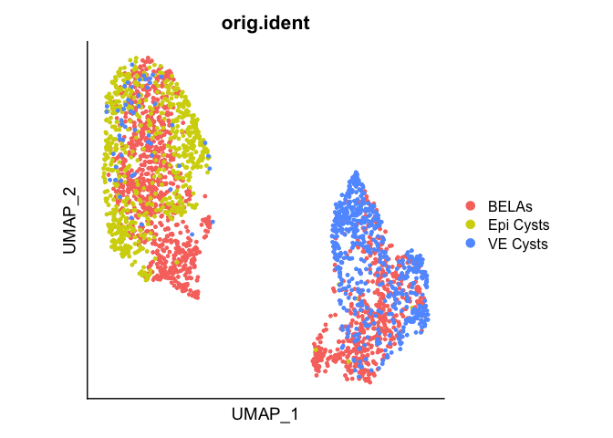<!-- -->

``` r
# ggsave("./Plots_Fig4_and_4Sup1/20220519_Fig4B.pdf", width = 5, height = 5)

# Fig 4C Feature Plots for PrE/Epi marker genes
DefaultAssay(in_vitro) <- "SCT"
markers <- c("Gata6", "Sox17", "Dab2", "Cubn", "Pou5f1", "Sox2", "Nanog", "Fgf4")
cutoffs<- c(NA, NA, NA, NA, NA, "2", "2", "1.5")
for (i in 1:length(markers)){
  print(FeaturePlot(in_vitro, features = markers[i], slot = "data", max.cutoff=cutoffs[i], pt.size = 1) + # slot = data makes most sence, better scale than counts
          scale_colour_gradientn(colours = viridis::cividis(100)) + theme(aspect.ratio = 1) +
          theme(axis.text= element_blank(), axis.ticks = element_blank()))
  # ggsave(paste("./Plots_Fig4_and_4Sup1/20220519_Fig4C_", markers[i], ".pdf", sep = ""), width = 5, height = 5)
}
```

    ## Scale for colour is already present.
    ## Adding another scale for colour, which will replace the existing scale.

    ## Scale for colour is already present.
    ## Adding another scale for colour, which will replace the existing scale.

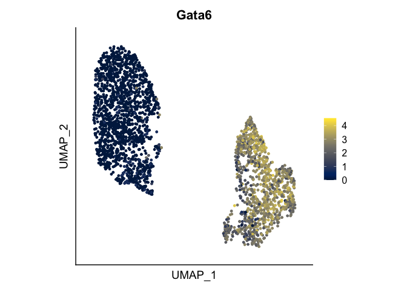<!-- -->

    ## Scale for colour is already present.
    ## Adding another scale for colour, which will replace the existing scale.

<!-- -->

    ## Scale for colour is already present.
    ## Adding another scale for colour, which will replace the existing scale.

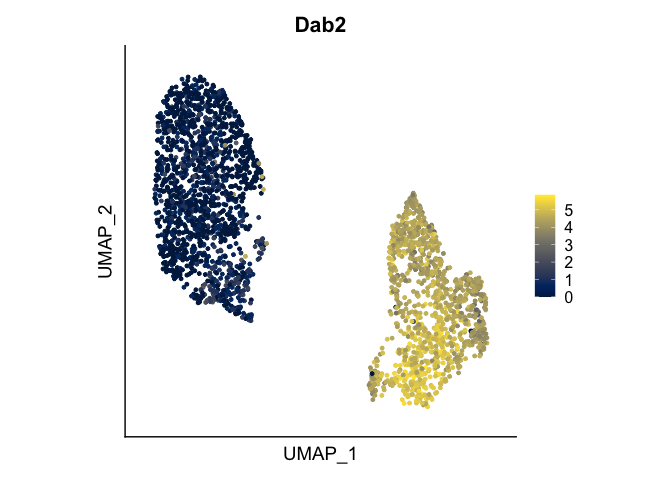<!-- -->

    ## Scale for colour is already present.
    ## Adding another scale for colour, which will replace the existing scale.

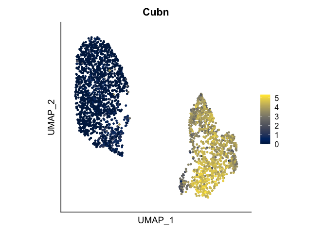<!-- -->

    ## Scale for colour is already present.
    ## Adding another scale for colour, which will replace the existing scale.

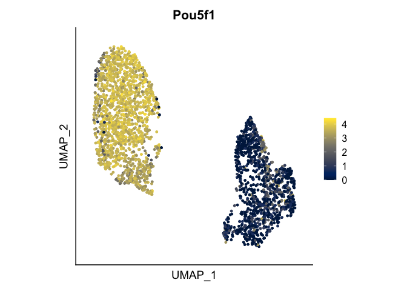<!-- -->

    ## Scale for colour is already present.
    ## Adding another scale for colour, which will replace the existing scale.

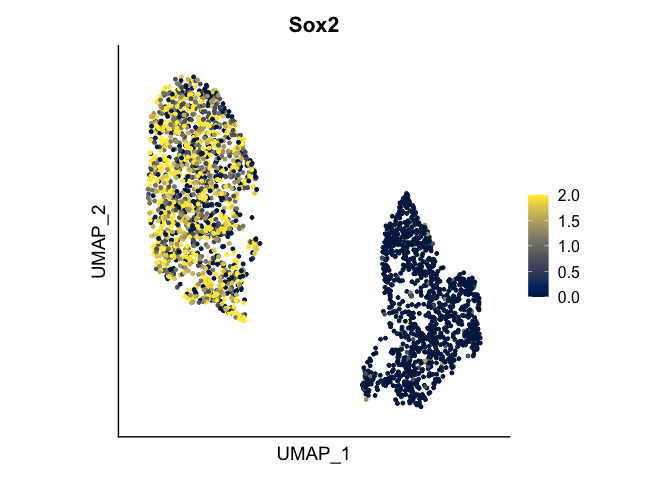<!-- -->

    ## Scale for colour is already present.
    ## Adding another scale for colour, which will replace the existing scale.

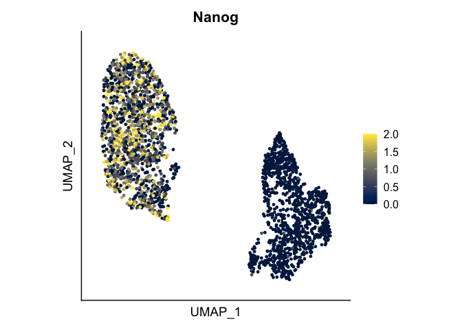<!-- --><!-- -->

``` r
# Clustering
DefaultAssay(in_vitro) <- "integrated"
in_vitro <- FindNeighbors(in_vitro, reduction = "pca", verbose = FALSE)
in_vitro <- FindClusters(in_vitro, resolution = 0.2, verbose = FALSE)
in_vitro <- RenameIdents(in_vitro, '0' = '3', '1' = '1', '2' = '2', '3' = '4')
levels(x = in_vitro) <- c('1', '2', '3', '4')
in_vitro$Cluster <- in_vitro@active.ident

# Umap by Cluster
DimPlot(in_vitro, reduction = "umap", group.by = "Cluster", pt.size = 1,
        cols = c("#8ABB93", "#0F5C35", "#C2A3C1", "#F6A348")) + 
  theme(aspect.ratio = 1, axis.text= element_blank(), axis.ticks = element_blank())
```

<!-- -->

``` r
# ggsave("./", width = 5, height = 5)

# Heatmap for sample fractions per cluster
in_vitro$Sample <- factor(in_vitro$orig.ident, levels = c("BELAs","VE Cysts","Epi Cysts"))
# pl_cell_frac_pheatmap_v2(in_vitro,
#                          column_data = "Cluster",
#                          row_data = "Sample",
#                          include_absolute_values = TRUE, 
#                          ratio = "column")


####
### DOES NOT REPRODUCE EXACT HEATMAP ###
#####
# Display differentially expressed genes of AVE as heatmap
# Problem seems to be: SCTransform before integration results in multiple models so one has to run it again. This results in small changes in list, not reproducing list of poster.
# Prepare Data for subsetting
in_vitro$orig_ident_CellType <- paste(in_vitro$Sample, in_vitro$Cluster, sep = ": ")
Idents(in_vitro) <- "orig_ident_CellType"

# DE Genes for AVE cluster
in_vitro <- PrepSCTFindMarkers(in_vitro) # This is a new step for multiple not connected models to get normalized
```

    ## Found 3 SCT models. Recorrecting SCT counts using minimum median counts: 58554

``` r
AVE.dif_AVE <- FindMarkers(in_vitro, assay = "SCT", ident.1 = "BELAs: 4", ident.2 = c("BELAs: 3", "VE Cysts: 3"), only.pos = TRUE, verbose = FALSE)
AVE.dif_PrE <- FindMarkers(in_vitro, ident.1 = c("BELAs: 3", "VE Cysts: 3"), ident.2 = "BELAs: 4", only.pos = TRUE, verbose = FALSE)


heat_data <- subset(in_vitro, idents = c("BELAs: 4", "BELAs: 3", "VE Cysts: 3"))
heat_data$orig_ident_CellType <- factor(heat_data@active.ident, levels = c("BELAs: 4", "BELAs: 3", "VE Cysts: 3"), ordered = TRUE)

heat_data <- SCTransform(heat_data, return.only.var.genes = FALSE, verbose = FALSE) # To get SCT for all genes

genes <- c(rownames(AVE.dif_AVE[order(-AVE.dif_AVE$avg_log2FC), ])[1:30], rownames(AVE.dif_PrE[order(-AVE.dif_PrE$avg_log2FC), ])[1:30])
heat_frame <- heat_data@assays[["SCT"]]@scale.data[genes,]
heatmap_col_anno <- data.frame("Cluster" = heat_data$orig_ident_CellType)
heat_frame <- heat_frame[,order(heat_data$orig_ident_CellType)]
pheatmap(heat_frame, scale = "none", cluster_rows = FALSE, col=viridis::cividis(100), show_colnames = FALSE,
         cluster_cols = FALSE, annotation_col = heatmap_col_anno, gaps_col = c(62,532), 
         cellwidth = 0.2, cellheight = 10, gaps_row = 30)#,
```

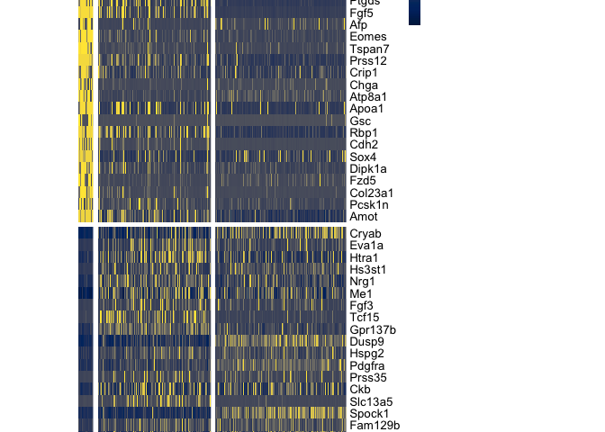<!-- -->

``` r
#         filename = "./Plots_Fig4_and_4Sup1/20220519_Fig4F.pdf", height = 10, width = 10)
# For horizontal heatmap
# pheatmap(t(heat_frame), scale = "none", cluster_rows = FALSE, col=viridis::cividis(100), show_rownames = FALSE,
#          cluster_cols = FALSE, annotation_row = heatmap_col_anno, gaps_row = c(62,532), 
#          cellwidth = 10, cellheight = 0.2, gaps_col = 30, angle_col = 90,
#          filename = "./Plots_Fig4_and_4Sup1/20220719_Fig4F.pdf", height = 6, width = 12)


# Plot Single FeaturePlots (with all cells)
DefaultAssay(in_vitro) <- "SCT"
FeaturePlot(in_vitro, feature = "Nodal") + theme(aspect.ratio = 1) +
  theme(axis.text= element_blank(), axis.ticks = element_blank())
```

<!-- -->

``` r
# ggsave("20230201_invitro_Nodal.pdf", width = 4, height = 4)
FeaturePlot(in_vitro, feature = "Sfrp1") + theme(aspect.ratio = 1) +
  theme(axis.text= element_blank(), axis.ticks = element_blank())
```

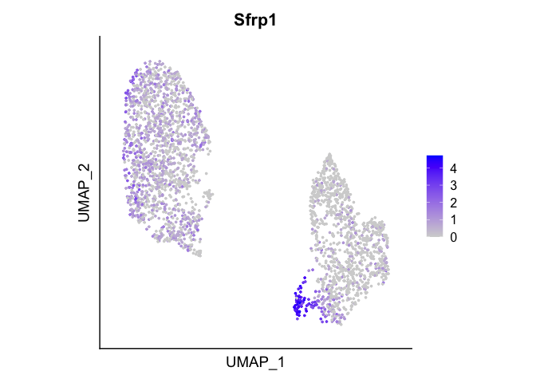<!-- -->

``` r
# ggsave("20230201_invitro_Sfrp1.pdf", width = 4, height = 4)
FeaturePlot(in_vitro, feature = "Cer1") + theme(aspect.ratio = 1) +
  theme(axis.text= element_blank(), axis.ticks = element_blank())
```

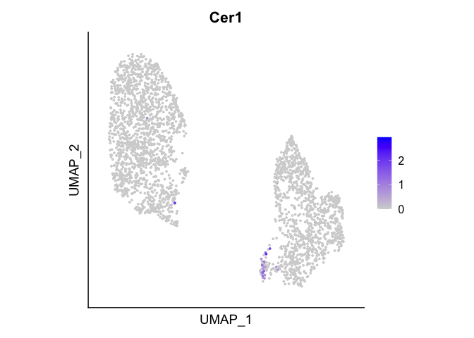<!-- -->

``` r
# ggsave("20230201_invitro_Cer1.pdf", width = 4, height = 4)
# Plot Single FeaturePlots (with only BELA cells)
BELAs_integrated <- subset(in_vitro, orig.ident == "BELAs")
FeaturePlot(BELAs_integrated, feature = "Nodal") + theme(aspect.ratio = 1) +
  theme(axis.text= element_blank(), axis.ticks = element_blank())
```

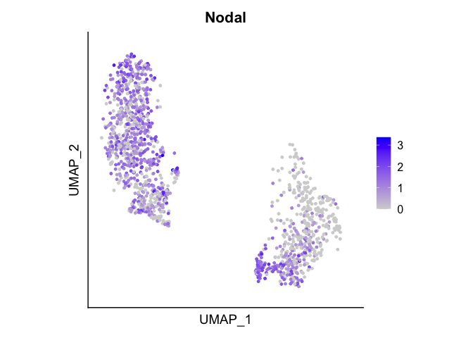<!-- -->

``` r
# ggsave("20230201_BELAs_Nodal.pdf", width = 4, height = 4)
FeaturePlot(BELAs_integrated, feature = "Sfrp1") + theme(aspect.ratio = 1) +
  theme(axis.text= element_blank(), axis.ticks = element_blank())
```

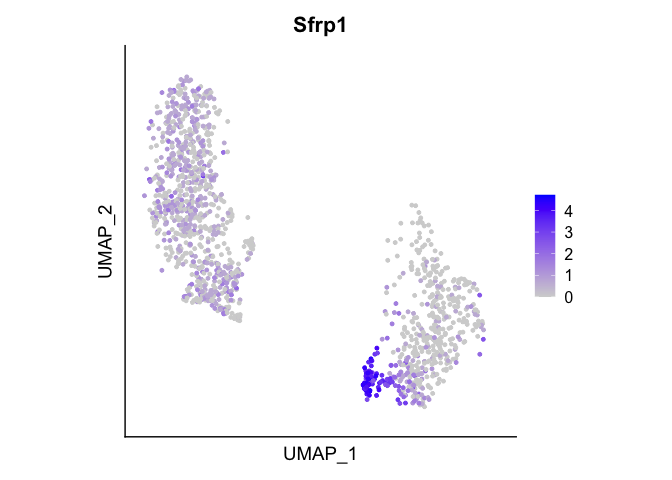<!-- -->

``` r
# ggsave("20230201_BELAs_Sfrp1.pdf", width = 4, height = 4)
FeaturePlot(BELAs_integrated, feature = "Cer1") + theme(aspect.ratio = 1) +
  theme(axis.text= element_blank(), axis.ticks = element_blank())
```

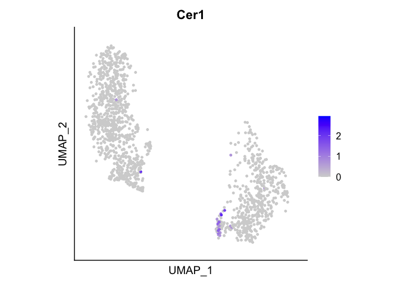<!-- -->

``` r
# ggsave("20230201_BELAs_Cer1.pdf", width = 4, height = 4)
FeaturePlot(in_vitro, feature = "Otx2") + theme(aspect.ratio = 1) +
  theme(axis.text= element_blank(), axis.ticks = element_blank())
```

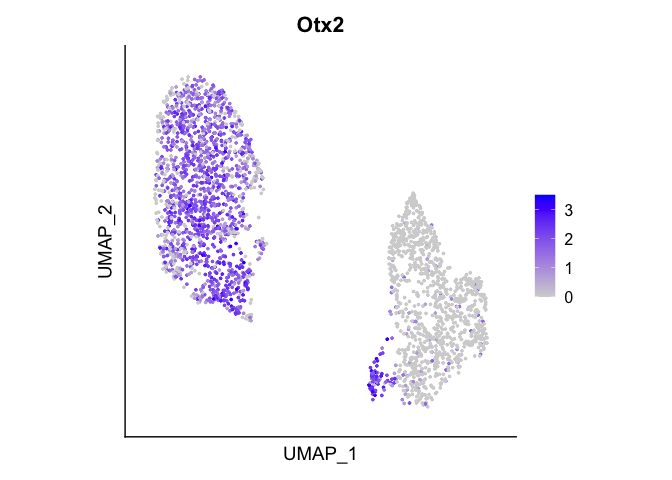<!-- -->

``` r
# ggsave("20230216_invitro_Otx2.pdf", width = 4, height = 4)
FeaturePlot(BELAs_integrated, feature = "Otx2") + theme(aspect.ratio = 1) +
  theme(axis.text= element_blank(), axis.ticks = element_blank())
```

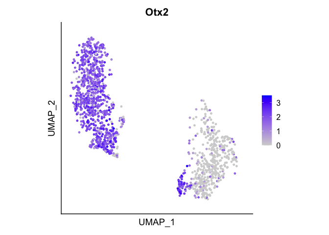<!-- -->

``` r
# ggsave("20230216_BELAs_Otx2.pdf", width = 4, height = 4)

# Export dataset for integration in python
in_vitro$orig_ident <- in_vitro$orig.ident
DefaultAssay(in_vitro) <- "RNA"
in_vitro[['integrated']] <- NULL
in_vitro[['SCT']] <- NULL

# SaveH5Seurat(in_vitro, filename = "./Data/in_vitro.h5Seurat")
# Convert("./Data/in_vitro.h5Seurat", dest = "h5ad")
```
